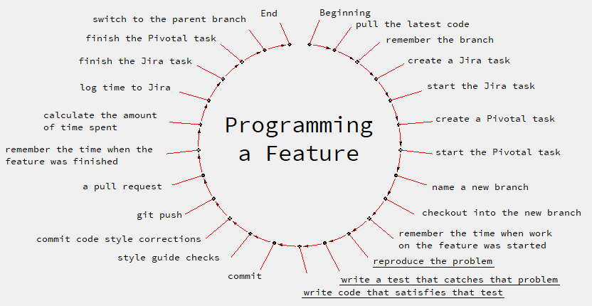

# Caperoma

### Automate your workflow with Ruby / Git / Jira / PivotalTracker.

## Support me on Patreon.
https://www.patreon.com/sergevinogradoff

## The idea.
Caperoma is a "full-cycle" command.

It solves everything that you need to do before you start working on the task, and everything you need to do after you finish the feature.

Caperoma solves for you: 
- pulling the latest code from upstream before you start working
- remembering from which branch you started the feature to later make a pull request into it
- creating & starting tasks in Jira
- creating & starting tasks in Pivotal
- naming branches
- adding Jira ID into the branch name
- style guide checks
- commits
- naming commits
- adding Jira ID into commit name
- adding Pivotal ID into commit name
- git pushes
- pull requests into correct branches
- stopping tasks in Jira
- stopping tasks in Pivotal
- tracking time
- logging time to Jira 
- switching back into the original branch
- and many more decisions that you often don't realize, and which you can forget hundreds of times during the time of working on the project.

This saves a ton of time.

You don't get distracted on things that you have to do thousands of times per year.

You focus only on solving tasks.

## Scheme

Everything that is not underlined Caperoma does for you.

The development of Caperoma is developing in the direction of closing this circle.

## Demo
You need to make a feature.
```bash
caperoma feature -t "your first feature"
touch ./your_first_feature.rb
rspec .
caperoma finish
```
That's it.

Open Github and you'll see a pull request into the branch from which you started.

The branch and the commit have correct names.

PivotalTracker has a new task.

Jira received the time you spent.

Caperoma did tens of steps for you.

You would spend about 10 minutes manually pressing the buttons in Github, Jira and Pivotal and entering these commands into the console.
10 minutes for each task, in a project with 1000 tasks, you save up to 20% of the project budget that you did not spend on a routine.

Thanks to Caperoma, you can spend this 20% on new features or fixing bugs.

Not to mention the invaluable savings of brain resources that allow you to easily work on larger projects.

At the same time, tracking systems receive the most accurate information about the work done for further statistics.

## Demo 2
You urgently need to fix the bug.
```bash
caperoma bug -t "your urgent bugfix"
touch ./your_urgent_bugfix.rb
caperoma finish
```
Every second of delay brings company losses which are often much higher than the price of the bug fix.

Caperoma did all the management for you.

You did not have to do manually dozens of these steps in a hurry (pull requests, time tracking, etc.).

You also did not have to sacrifice conventions for the sake of speed (which often turns into a bad habit, driving a project to a standstill).

You implemented the solution, but on the way to it, you were secured by the Caperoma's algorithms.

## Task types supported by Caperoma

- ***Feature*** - a task of a "feature" type with a commit in a new branch.
- ***Bug*** - a task of a "bug" type with a commit in a new git branch.
- ***Fix*** - a task with a commit in the current git branch.
- ***Chore*** - a task without a commit.
- ***Meeting***

Jira IDs for each of them, as well as other settings, can be set in `Capefile`.

## Ubuntu Setup
```bash
sudo apt install -y sqlite3 crontab git
```

## Installation
```bash
gem install caperoma

caperoma setup # initializes the database

# Allow Caperoma to make pull requests and start tasks on your behalf.
caperoma accounts add --jira login api_access_token assignee
caperoma accounts add --pivotal login api_access_token
caperoma accounts add --git login password
# You can find your API tokens on the settings pages in Jira and PivotalTracker.
# Usually, on these pages:
# https://www.pivotaltracker.com/profile
# https://id.atlassian.com/manage/api-tokens

# All the data is stored only on your computer (in the database ~/.caperoma.sqlite3 that was created with `caperoma setup` command).

# Also, set up your Github using SSH keys so that when you do "git push", Github wouldn't ask for a password.
```

## Setting up your project:
```bash
# Open your project
cd ~/myproject 

# Create Capefile
caperoma init 

# Add your Jira link to Capefile: 
echo "jira_url: https://yourproject.atlassian.net/" >> Capefile  

# Get project IDs from Jira
caperoma get_jira_project_ids
# The response will be something like this:
# 1) Awesome Project (jira_project_id: 1234)
# ...

# Paste the received project ID into Capefile
echo "jira_project_id: 1234" >> Capefile

# Get issue type IDs from Jira:  
caperoma get_jira_issue_type_ids
# The response will be something like this:
# ID: 12, Name: Bug
# ID: 15, Name: Feature
# ...

# Get transition type IDs from Jira:
caperoma get_jira_transition_ids
# This command requires you to have at least one issue in the project, as it will be used to receive transition ids.
# The response will be something like this:
# ID: 30, Name: To do
# ID: 102, Name: In Progress
# ID: 201, Name: Done

# Enter the received IDs into corresponding fields in Capefile:
vim Capefile 

# Also, enter the rest of the settings into Capefile (git repository, Pivotal project ID, etc.).
```

## Demo 3: A simple feature.
```bash
caperoma feature -t "your first feature"
# Created a task in Jira with the title "your first feature".
# Took the ID of the created Jira feature (i.e. PRJ -123).
# Generated the name of the git branch considering Jira ID and task name (i.e. prj-123-your-first-feature).
# Pulled the latest version of the current branch from upstream (i.e. git fetch && git rebase origin/master).
# Switched into a new git branch with the mentioned name (i.e. git checkout -b prj-123-your-first-feature).
# Status of the task in Jira changed to "in progress".
# Started the timer.

touch ./your_first_feature.rb
# Created an empty file ./your_first_feature.rb.

caperoma finish
# Generated the name of the commit taking into account the IDs (i.e. "[PRJ-123] Your first feature").
# Commit changes (i.e. git add -A && git commit -m "[PRJ-123] Your first feature").
# Running a code check for compliance with standards (i.e. rubocop -a).
# Commit code standardization (i.e. git add -A && git commit -m "[PRJ-123] Applying good practices").
# Upload a new branch to the repository (i.e., git push --set-upstream origin prj-123-your-first-feature).
# Sent a pull request on your behalf into the branch from which you started working on this feature (i.e. if you were in 'develop' branch at the time you called 'caperoma feature', a pull request will be sent into 'develop' branch from the branch prj-123-your-first-feature).
# Timer stopped.
# Duration of work sent to Jira.
# Status of the task in Jira changed to "done".
# Switched back to the branch from which the work was started (for example, git checkout master).
```

## Demo 4: A feature with Pivotal ID and your work description:
```bash
caperoma feature --t "your second feature" -p 12345678
# Same as before, but also:
# A Pivotal task was launched with ID #12345678.

touch ./your_first_feature.rb

caperoma finish "I made a new file"
# Same as before, but also:
# The Pivotal task #12345678 changed the status to "finished".
# The commit now contains Pivotal ID: "[PRJ-123][#12345678] Your second feature".
# In the pull request now contains a link to Pivotal task #12345678 (this link: https://www.pivotaltracker.com/story/show/12345678) and the description "I made a new file".
# The comment "I made a new file" added to Jira.
```

## Demo 5: A feature with adding time (in minutes):
```bash
caperoma feature -t "your third feature" -p 12345678 -a 23
# same as before (Demo 4), but notice -a 23 parameter.
# -a 23 says to add 23 minutes on top of time recorded by the timer.
# The alternative version of this parameter is: --additional_time 23

touch ./your_first_feature.rb

caperoma finish
# Time sent to Jira will be 23 minutes more than the timer recorded.
# I.e. if you spent 10 minutes on this task, Jira will receive 33 minutes (10+23, "timer time" + "additional time").
```

# Caperoma can send reports to your boss about what tasks are finished and how much time was spent on each one and all of them together (every day / every 3 days / every week).
```bash
# Setup:

# Add your email (only Gmail is supported):
caperoma accounts add --gmail email password

# Add recipients:
caperoma recipients add your_supervisor@domain.com
caperoma recipients add your_team_lead@domain.com

# Turn on automatic reports:
caperoma report auto on
```
The recipients will get:
- a daily report every day
- a 3-day report on Wed and Fri
- a weekly report on Fri

(8 reports per week in total)

(they are sent at 5 pm, so at that time the computer should be on, as the reports are using crontab).

The format of the emails is a table that lists all the tasks during the mentioned period:
- Jira ID (with a link).
- Pivotal ID (with a link).
- Task title.
- The amount of time spent on the task.

Plus the total amount of time spent on them.


Each report includes only the tasks that were not yet included in the previous reports of this type.

I.e. if you finished the feature "X" and sent a "daily report" that includes it, then your next "daily report" will not include it (even if you send the second one immediately after the first one), however it will still be included in your next "3 day report" and into your next "weekly report".

You no longer need to spend 3 to 5 unpaid hours on Friday night, making a report in which you are trying to remember which features you created 4 days ago (by the end of the week there are already so many that you probably lost count of half of them).

The reports can be sent manually:
```bash
caperoma report daily # sends daily report now
caperoma report three_day # sends 3-day report now
caperoma report weekly # sends weekly report now
```

## List of all the commands:
### Setup
`caperoma setup` - creates the database (~/.caperoma.sqlite3) on your computer.

### Initialize
`caperoma init` - initializes Caperoma inside a project (creates Capefile).

### Get Project IDs from Jira 
`caperoma get_jira_project_ids` - see what project IDs does your Jira support, to put them into the Capefile.

### Get Issue IDs from Jira 
`caperoma get_jira_issue_type_ids` - see what issue IDs does your Jira support, to put them into the Capefile.

### Get Transition IDs from Jira 
`caperoma get_jira_transition_ids` - see what transition IDs does your Jira support, to put them into the Capefile.

### Status
`caperoma status` - shows a task you are working on now.
Example:
```bash
$ caperoma status
You are working on:
Title: Some task
Type: Feature
Jira ID: PRJ-24 (https://example.atlassian.net/browse/PRJ-24)
Pivotal ID: 167396414 (https://www.pivotaltracker.com/story/show/167396414)
Time spent at the moment: 2h 50m
Pull request will be sent to this branch: master

$ caperoma finish
...
$ caperoma status
You are not working on anything now.
```

`caperoma projects` - shows the list of projects on this computer.
Example:
```bash
$ caperoma projects
1) Good project (jira_project_id: 10000)
2) Best project  (jira_project_id: 10014)
3) Cosmic project (jira_project_id: 10534)
```

### Starting Tasks
#### Start a Feature
`caperoma feature [options]` - Creates a feature in a new branch:
- Downloads the latest version of the code from Github.
- Creates and starts a task in Jira.
- Creates and starts a task in Pivotal.
- Generates the name of the branch.
- Remembers from which branch you started working.
- Switches into new a branch.
- Starts the timer.
- *If the -p parameter is specified, Caperoma starts Pivotal task with this ID.*
- *If the -p parameter is not specified, Caperoma will create a new task in Pivotal, start it and use its ID.*
- *The creation of certain types of tasks in Pivotal (when -p is absent) can be turned on or off in Capefile.*
- *If you are already working on something, you won't be able to start a new task. First you will have to finish or pause the current task.*

`options`:

`-t`, `--title` - The name of the feature (for a commit, pull request, tasks in Jira and Pivotal). ` -t` and `--title` are different versions of the same option.


`-d`, `--description` - The description (for a task in Jira and Pivotal).


`-p`, `-ptid`, `--pivotal_task_id` - ID of task in Pivotal (automatically gets started/finished during the work on it in Caperoma).


`-a`, `--additional_time` - Additional time (in minutes). Intended for cases when you want to indicate that you started working on it X minutes ago (X minutes before starting Caperoma timer). For example, for 1 hour you tried to reproduce the problem before you realized that you need to start a new task. Or if you forgot to start Caperoma. Additional time is always in minutes. Adding 125 minutes (-a 125) will mean that you spent 2h 5m on the task before turning on Caperoma timer.

*The order of options is not important.*

*Immediately after the operator must be a value.*

Examples:
```bash
caperoma feature -t "my feature"
# (start the feature in the new branch)

caperoma feature -t "my feature" -a 10
# (start the feature in the new branch, and add 10 minutes to it at the end)

caperoma feature -t "title" -d "description" -p 4830184 -a 48
# (create a feature with the description of "description", Pivotal ID #4830184, and add 48 minutes)

caperoma feature --title "title" --description "description" --pivotal_task_id 1000001 --additional_time 5
# (create the feature "title" with the description of "description" and Pivotal ID #1000001, on which you started working 5 minutes ago)
```

#### Start a Bug 
`caperoma bug [options]` - Creates a bug in the new branch.

Does almost the same thing as `caperoma feature`, just starts everywhere the tasks of a type "bug".

`options`: same as for `caperoma feature`

Example:
```bash
caperoma bug -t "something isn't working" -a 20
# (starts a "bug" called "something isn't working" in the new branch and adds 20 minutes to the timer)
```

#### Start a Fix  
`caperoma fix [options]` - Creates a fix in the CURRENT branch, doing at the end just "git push" into the branch, not a pull request.

Everything else is almost the same as `caperoma feature`.

This command is created for the cases when you already have a remote branch, or if you already made a pull request, and you need to go back to it and add something.

This command considers the specifics of work with open pull requests and remote branches:
- Downloads the latest version of the current branch before starting the work and again before pushing the changes.
- Changes are made in a new commit instead of a potentially conflicting amend.
- Leaves the title and description of pull requests.

`options`: same as for `caperoma feature`

Example:
```bash
caperoma fix --title "Spelling fix" -d "Fix the spelling mistake"
# (in the current branch - into which you manually switched - start a fix with the name "Spelling fix" and the description "Fix the spelling mistake")
```

#### Start a Meeting 
`caperoma meeting [options]` - Creates a meeting.

For cases when you need to record to Jira the facts of talking on the phone with your coworkers.

Jira ID for the meeting (as for other types of tasks) can be set in Capefile (by default it has the same value as a chore).

In Pivotal creating meetings is off by default. It can be turned on in Capefile. If it is on, Caperoma will create "chores".

`options`: same as for `caperoma feature`

This feature is sometimes used to automate logging phone calls to Jira.

For example, in Skype, you could configure it to call the command `caperoma meeting -t "meeting"` when you pick up the phone and call `caperoma finish` when you hang up.

As a result, Skype conversations will automatically be entered into Jira with accuracy up to a minute.

5-10 people can participate in a conference call, so if each of them sets up Caperoma, you can save a couple of man-hours for each call.

Example:
```bash
caperoma meeting -t "title"
```

#### Start a Chore
`caperoma chore [options]` - Creates a chore. Without branch and commit.

For cases when the goal of the task is not committing code.

For example, you need to configure something on a remote server.

`options`: same as for `caperoma feature`

Example:
```bash
caperoma chore -t "going downtown to pick up a new computer" -a 10
# (create a job without a commit, with the name "going downtown to pick up a new computer", started 10 minutes ago)
```

### Finishing tasks

#### Finish current task
`caperoma finish [optional comment]` - ends a task of any type.

Do everything that you usually do after finishing a task:
- git commit (feature, bug, fix) [commit name consists of the task title, Jira ID and Pivotal ID]
- runs style guide checks (rubocop -a)
- commit style guide corrections
- git push (feature, bug, fix)
- makes a pull request into the branch from which you started this task, e.g. if you were in "development" branch when you started a new feature, Caperoma will make a pull request into the "development" branch. (feature, bug) [the name of the pull request is the name of the task] 
- changes the status of Jira task to "done"
- changes the status of Pivotal task to "finished"
- Calculates elapsed time.
- sends the time spent to Jira.
Examples:
```bash
caperoma finish
# regular finish of any task

caperoma finish "completed"
# finish, plus send a message "completed" into Jira and the pull request.
```

#### Abort current task
`caperoma abort [optional comment]` - finish without committing / pushing changes.

This command does what you usually need to do to interrupt the task:
- Logs time to Jira.
- changes the status of Jira task to "done"
- changes the status of Pivotal task to "finished"
- switches to the main branch

All changes to files remain uncommitted.

Examples:
```bash
caperoma abort "can't reproduce"
# interrupt + write a comment "can't reproduce" in Jira

caperoma abort
```

#### Abort current task without logging time
`caperoma abort_without_time [optional comment]` - same as abort, but does not log time to Jira

Only changes the status of Jira task to "done".

Pivotal task remains started.

Files remain uncommitted.

Example:

Suppose you started a task and fall asleep.

You wake up, the timer is still running.

You stop the timer without logging time to Jira:
```
caperoma abort_without_time
```

#### Pause current task
`caperoma pause [optional comment]` — stop work on the task, but not consider it completed (don't make a pull request).

What it will do:
- git commit (feature, bug, fix) [commit name consists of the task title, Jira ID and Pivotal ID]
- runs style guide checks (rubocop -a)
- commit style guide corrections
- git push (feature, bug, fix)
- changes the status of Jira task to "done"
- changes the status of Pivotal task to "finished"
- Calculates elapsed time.
- sends the time spent to Jira.

To finish the paused task, you will need to manually switch into its branch and inside it do `caperoma fix -t "continuation"`, and then make a pull request manually.

Finishing the task will be done by new independent tasks in Jira.

Example:

Suppose you need to urgently switch to another task.
```bash
...
caperoma pause

# do your urgent thing, say a meeting:
caperoma meeting -t 'an urgent meeting'
caperoma finish

# go back
git checkout my-unfinished-feature
caperoma fix -t "finishing the feature"
#... do the work
caperoma finish
# make a pull request manually
```

### Accounts

#### List Accounts
`caperoma accounts` - show the list of accounts (passwords are not shown).

#### Adding Accounts
`caperoma accounts [add command] [account_type] [login] [password] [assignee]` - add (or overwrite) an account of type [account_type] to the database.

`[add command]`: `-a`, `add`, `--add`, `-c`, `create`, `--create` (all these are equivalent).

`[account_type]`: One of: `--jira`, `--pivotal` `--git`, `--gmail`

`[login]` is your account login (email or username).

`[password]` for --jira and --pivotal should be api_tokens (password won't do). for --git and --gmail it should be your password.

`[assignee]` is only for --jira, for other types no need to write anything there.

Examples:
```bash
caperoma accounts add --git login password          # Add Git account
caperoma accounts create --jira login password      # Add Jira account
caperoma accounts --add --pivotal login password    # Add Pivotal account
caperoma accounts --create --gmail login password   # Add Gmail account for reports
```

* You can have only one account of each type.
* Adding a new account of the same type (e.g. a new --jira account) will overwrite the old account of the same type.

#### Removing accounts
`caperoma accounts [remove_command] [account_type]` - remove an account of a given type.

`[remove_command]`: `remove`, `--remove`, `-r`, `delete`, `--delete`, `-d` (all these are equivalent).

`[account_type]`: One of the following: `--jira`, `--pivotal`, `--git`, `--gmail`

Examples:
```bash
caperoma accounts --remove --git  # Remove Git account
caperoma accounts remove --jira   # Remove Jira account
caperoma accounts -d --pivotal    # Remove Pivotal account
caperoma accounts -delete --gmail # Remove Gmail account for reports
```

### Deleting all data from this computer
`caperoma delete_history` - removes the caperoma database, so deletes the information on the tasks, time spent, branch names, account credentials, etc.

Keeps the folders of your projects intact.

### Version:
`caperoma -v` - shows Caperoma version

`caperoma version` - shows Caperoma version

### Recipients
#### List Recipients
`caperoma recipients` - shows the list of emails on which reports should be sent.

#### Adding Report Recipients:
`caperoma recipients [add command] [email]` - adds an email of a recipient of your reports to the database.

`[add command]`: `-a`, `add`, `--add`, `-c`, `create`, `--create` (all these are equivalent).

`[email]` - the email of the recipient

Examples:
```bash
caperoma recipients add "your_boss@domain.com"
caperoma recipients create "your_boss@domain.com"
caperoma recipients --create "your_boss@domain.com"
caperoma recipients -a "your_techlead@domain.com"
caperoma recipients --add "your_techlead@domain.com"
```

#### Removing Report Recipients
`caperoma recipients [remove command] [email]` - removes the `[email]` of the recipient of your reports from the database.

`[remove command]`: `remove`, `--remove`, `-r`, `delete`, `--delete`, `-d` (all these are equivalent).

Examples:
```bash
caperoma recipients remove "your_boss@domain.com"
caperoma recipients -r "your_techlead@domain.com"
caperoma recipients --delete "your_supervisor@domain.com"
```

### Automatic Reports
`caperoma report auto on` - turns on automatic report sending to all your recipients.

`caperoma report auto off` - turn off automatic report sending to all your recipients.

### Sending Reports Manually
`caperoma report daily` - send a daily report right now

`caperoma report -d` - send a daily report right now

`caperoma report three_day` - send a three-day report right now

`caperoma report -t` - send a three-day report right now

`caperoma report weekly` - send a weekly report right now

`caperoma report -w` - send a weekly report right now

### Support me on Patreon.
https://www.patreon.com/sergevinogradoff

### Contributing to caperoma
* Check out the latest master to make sure the feature hasn't been implemented or the bug hasn't been fixed yet.
* Check out the issue tracker to make sure someone already hasn't requested it and/or contributed it.
* Fork the project.
* Start a feature/bugfix branch.
* Commit and push until you are happy with your contribution.
* Make sure to add tests for it. This is important so I don't break it in a future version unintentionally.
* Please try not to mess with the Rakefile, version, or history. If you want to have your version, or is otherwise necessary, that is fine, but please isolate to its commit so I can cherry-pick around it.

### Copyright
Copyright (c) 2014-2019 Serge Vinogradoff. See LICENSE.txt for further details.
